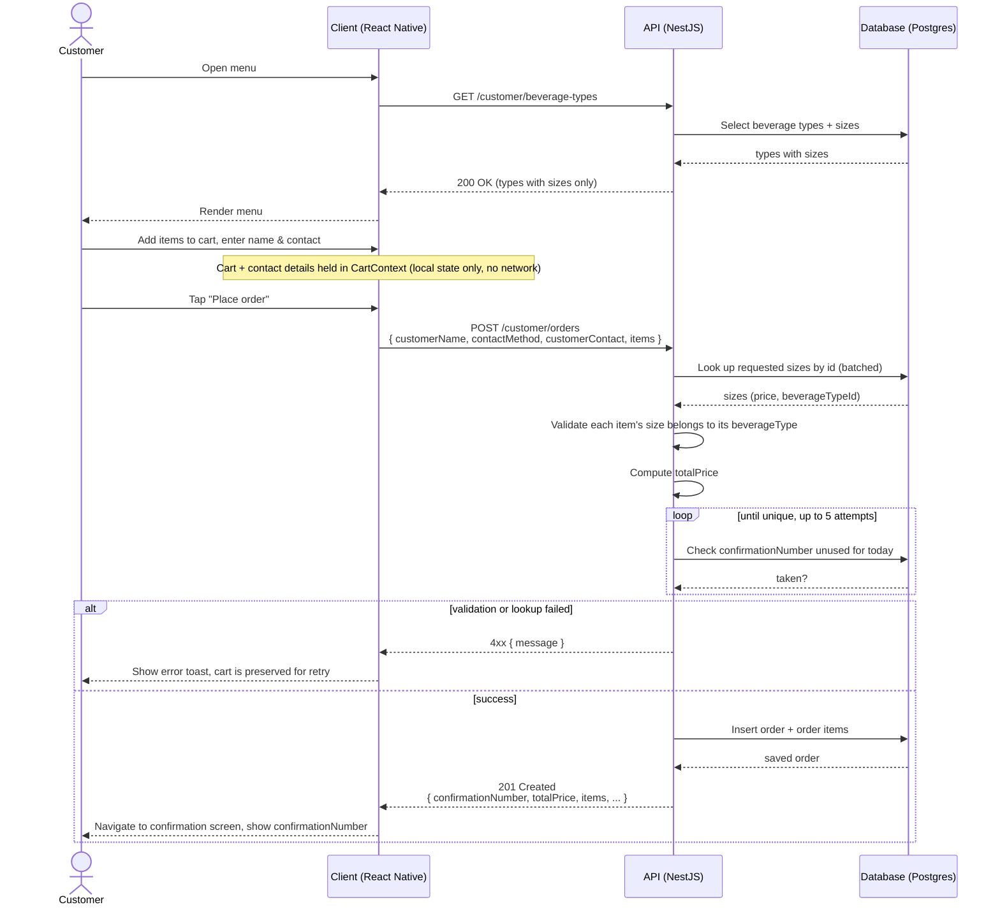

# Lemonade Stand

This project is a mobile ordering app for a lemonade stand. A customer can browse the beverages, build an order, and get a confirmation number. An admin can manage the beverage catalog through a separate set of API endpoints.

The project has two parts:

- `server/`: an API that uses NestJS, TypeORM, and PostgreSQL.
- `client/`: a React Native (Expo) app.

## Prerequisites

Before you start, make sure you have these tools:

- Node.js, version 22 or later
- npm
- [Docker Desktop](https://www.docker.com/products/docker-desktop/) (recommended). Use it to run the backend and the database.
- Xcode (Mac only). Use it for the iOS Simulator. See the note below about why this is the tested path.

**Note:** The client will **not** run in the plain [Expo Go](https://expo.dev/go) app. Use `npm run ios` to build and launch it on the iOS Simulator; see [Frontend (`client/`)](#frontend-client) below.

## Backend (`server/`)

### Run with Docker (recommended)

```bash
cd server
docker compose up -d --build
```

This command starts two containers:

- `postgres`: runs Postgres 16. This container uses a named volume, so the data survives a restart.
- `app`: runs the NestJS API. Docker builds this container from `server/Dockerfile`.

Once the containers are running, you can reach these URLs:

- API: `http://localhost:3000`
- Health check: `http://localhost:3000/api/health`
- Swagger docs (interactive): `http://localhost:3000/docs`

The `admin/*` routes do not need authentication (see [Assumptions & Design Choices](#assumptions--design-choices)). You do not need a key or a header to call them.

To stop the containers, run `docker compose down`. Add the `-v` flag to also delete the Postgres volume and its data.

### Run locally (without Docker)

You need your own Postgres instance, version 14 or later. The file `.env.example` expects these settings:

- Database name: `lemonade`
- Database owner: `lemonade`
- Password: `lemonade`
- Host: `localhost:5432`

A fresh Postgres install has none of this. Create it first with one command:

```bash
psql postgres -c "CREATE ROLE lemonade WITH LOGIN PASSWORD 'lemonade'; CREATE DATABASE lemonade OWNER lemonade;"
```

Then run:

```bash
cd server
cp .env.example .env   # works unedited against the database created above
npm install
npm run start:dev
```

The app creates its own database schema when it starts (`synchronize: true`; see [Assumptions](#assumptions--design-choices)). You do not need to run a manual migration step.

### Seeding beverage data

A fresh database has no beverage types. Because of this, the client's menu is empty until you create some. Run:

```bash
cd server
npm run seed
```

This command creates a few sample beverage types, each with sizes and prices. It uses the same `BeverageTypesService` and `BeverageSizesService` that the admin API uses.

The command also creates one type with no sizes yet: "Seasonal Special". Use this type to check that the customer-facing list, `GET /customer/beverage-types`, excludes types with no price. See `server/src/seed.ts` for the code.

You can also create data by hand, through the admin endpoints. Use the Swagger UI at `/docs`, or use curl. For example:

```bash
curl -X POST http://localhost:3000/api/v1/admin/beverage-types \
  -H "Content-Type: application/json" \
  -d '{"name":"Classic Lemonade","description":"Fresh-squeezed lemons, cane sugar, ice-cold."}'

curl -X POST http://localhost:3000/api/v1/admin/beverage-sizes \
  -H "Content-Type: application/json" \
  -d '{"label":"Small","price":2.50,"beverageTypeId":"<id from the response above>"}'
```

### API Reference

Start the server, then go to **`http://localhost:3000/docs`** for the full interactive documentation (Swagger UI). This page includes a try-it-out console.

The reference below lists the same endpoints. Use it for quick copy-and-paste examples.

All paths below are relative to the base URL `http://localhost:3000/api/v1`.

- The app calls the `customer/*` endpoints.
- Use the `admin/*` endpoints to manage the catalog and to list orders. These endpoints do not need authentication (see [Assumptions & Design Choices](#assumptions--design-choices)).

#### Beverage types

| Method | Path | Description |
| --- | --- | --- |
| GET | `/customer/beverage-types` | List orderable beverage types (types with at least one size) |
| GET | `/customer/beverage-types/:id` | Get one beverage type |
| GET | `/admin/beverage-types` | List **all** beverage types, including types with no sizes yet |
| GET | `/admin/beverage-types/:id` | Get one beverage type |
| POST | `/admin/beverage-types` | Create a beverage type |
| PATCH | `/admin/beverage-types/:id` | Update a beverage type (you can send any subset of the create fields) |
| DELETE | `/admin/beverage-types/:id` | Delete a beverage type and its sizes (returns `204 No Content`) |

`POST`/`PATCH` request body:

```jsonc
{
  "name": "Classic Lemonade",
  "description": "Fresh-squeezed lemons, cane sugar, ice-cold." // optional
}
```

Response (`GET`/`POST`):

```jsonc
{
  "id": "b1f2c3d4-5678-90ab-cdef-1234567890ab",
  "name": "Classic Lemonade",
  "description": "Fresh-squeezed lemons, cane sugar, ice-cold.",
  "sizes": [
    { "id": "8a9b0c1d-...", "label": "Small", "price": "2.50", "beverageTypeId": "b1f2c3d4-..." }
  ]
}
```

#### Beverage sizes

| Method | Path | Description |
| --- | --- | --- |
| GET | `/customer/beverage-sizes` | List all beverage sizes |
| GET | `/customer/beverage-sizes/:id` | Get one beverage size |
| GET | `/admin/beverage-sizes` | List all beverage sizes |
| GET | `/admin/beverage-sizes/:id` | Get one beverage size |
| POST | `/admin/beverage-sizes` | Create a size (and a price) for a beverage type |
| PATCH | `/admin/beverage-sizes/:id` | Update a size (you can send any subset of the create fields) |
| DELETE | `/admin/beverage-sizes/:id` | Delete a size (returns `204 No Content`) |

`POST`/`PATCH` request body:

```jsonc
{
  "label": "Small",
  "price": 2.50,
  "beverageTypeId": "b1f2c3d4-5678-90ab-cdef-1234567890ab" // id of an existing beverage type
}
```

#### Orders

| Method | Path | Description |
| --- | --- | --- |
| POST | `/customer/orders` | Submit an order (the response includes a confirmation number) |
| GET | `/admin/orders` | List all submitted orders, newest first |

`POST /customer/orders` request body:

```jsonc
{
  "customerName": "Jane Doe",
  "contactMethod": "email", // "email" | "phone"
  "customerContact": "jane@example.com", // valid email, or ≥7 digits if contactMethod is "phone"
  "items": [
    { "beverageTypeId": "b1f2c3d4-...", "sizeId": "8a9b0c1d-...", "quantity": 2 }
  ]
}
```

Response:

```jsonc
{
  "id": "d4e5f6a7-...",
  "confirmationNumber": "LM-482913",
  "customerName": "Jane Doe",
  "contactMethod": "email",
  "customerContact": "jane@example.com",
  "totalPrice": "5.00",
  "orderDate": "2026-08-31",
  "createdAt": "2026-08-31T10:15:00.000Z",
  "items": [
    {
      "beverageTypeId": "b1f2c3d4-...",
      "beverageName": "Classic Lemonade",
      "sizeId": "8a9b0c1d-...",
      "sizeLabel": "Small",
      "unitPrice": "2.50",
      "quantity": 2
    }
  ]
}
```

### Backend tests

```bash
cd server
npm test          # unit tests
npm run test:cov  # unit tests with coverage
npm run test:e2e  # end-to-end tests
```

## Frontend (`client/`)

```bash
cd client
cp .env.example .env   # EXPO_PUBLIC_API_URL, defaults to http://localhost:3000/api/v1
npm install
npm run ios             # first run: builds a custom dev client and launches the iOS Simulator
```

**Note: development and testing focused on iOS simulator, due to time constraints.**

Use `npm run ios` (`expo run:ios`). This is the tested and recommended path.

- On the iOS Simulator: the default value, `http://localhost:3000/api/v1`, works with no change.
- On a physical device, running its own dev-client build: use machine's LAN IP instead.

### Frontend tests

```bash
cd client
npm test
```

## Assumptions & Design Choices

1. **`synchronize: true` on the TypeORM connection.** When the app starts, TypeORM creates and updates the database schema automatically from the entities. This is convenient for a take-home project, but it is not safe for a production database with real data. A production setup should use TypeORM migrations instead.
2. **The admin routes (`/admin/*`) are public on purpose.** They have no login, no API key, and no role system in front of them. This choice keeps catalog management easy to test. A production setup should add real permission control in front of these routes.
3. **The seed script (`npm run seed` in `server/`).** It uses the same admin services as the API, rather than inserting rows directly, so the seeded data goes through the same validation as a normal API call. You can also create beverage types and sizes by hand, through the admin API (see above).
4. **Postgres stores prices as `decimal` columns, as strings.** This avoids floating-point rounding issues with money. The client converts each price to a `number` at the API boundary, for display and for arithmetic.
5. **The client never sends a price to the server — there's no need to.** `POST /customer/orders` only accepts `beverageTypeId`, `sizeId`, and `quantity` for each line item; the DTO has no `price`/`totalPrice` field at all, so there's nothing for the client to send. The server looks up each size's current price in the database and computes `unitPrice` and `totalPrice` itself. The client still computes and displays a running total locally, as the cart is built, purely for the user interface; that figure never leaves the device, and the server computes its own authoritative total at submission time.
6. **Confirmation numbers.** Each number has the prefix `LM-`, followed by a random 6-digit number. The server checks each number against existing orders to make sure it is unique, and retries a few times before giving up.
7. **The cart state lives only in memory** (React Context) and is not saved to device storage. Because of this, a reload or an app restart clears the in-progress order. Submitted orders, of course, are persisted server-side.
8. **The customer picks a contact method, phone or email, with a toggle.** The validation, on both the client and the server, adapts to the selected method.

## Bonus Features Implemented

1. **Unit tests.** Both apps have unit test coverage.
   - Backend: services, controllers, the global exception filter, and DTO input-validation tests for every module (using `class-validator`'s `validate()` directly against each DTO).
   - Frontend: the cart context and state management, the `useBeverages` data-fetching hook, the `lib/` API layer (request handling, error mapping, response shaping), and a shared component.
2. **Input validation on both sides.**
   - The backend uses a global `ValidationPipe` (`whitelist`, `forbidNonWhitelisted`, `transform`) plus `class-validator` decorators on every DTO — UUIDs, enums, positive numbers, required strings, and nested array validation for order line items — including a custom validator that checks `customerContact` is a well-formed email or phone number, depending on the selected `contactMethod`.
   - The frontend's customer-details form uses `react-hook-form` with `zod` for validation (name length, and phone or email format depending on the selected contact method).
3. **State management.** `@tanstack/react-query` handles all server data (beverages, order submission), with proper loading, error, and refetch states. React Context (`CartProvider`) handles local cart state, shared across the ordering flow.
4. **Containerization.** `server/Dockerfile` (a multi-stage build) and `server/docker-compose.yml` run the API and Postgres together, each with a health check.
5. **Sequence diagram.** See the [Order Placement Flow](#order-placement-flow) section below.

## Order Placement Flow


