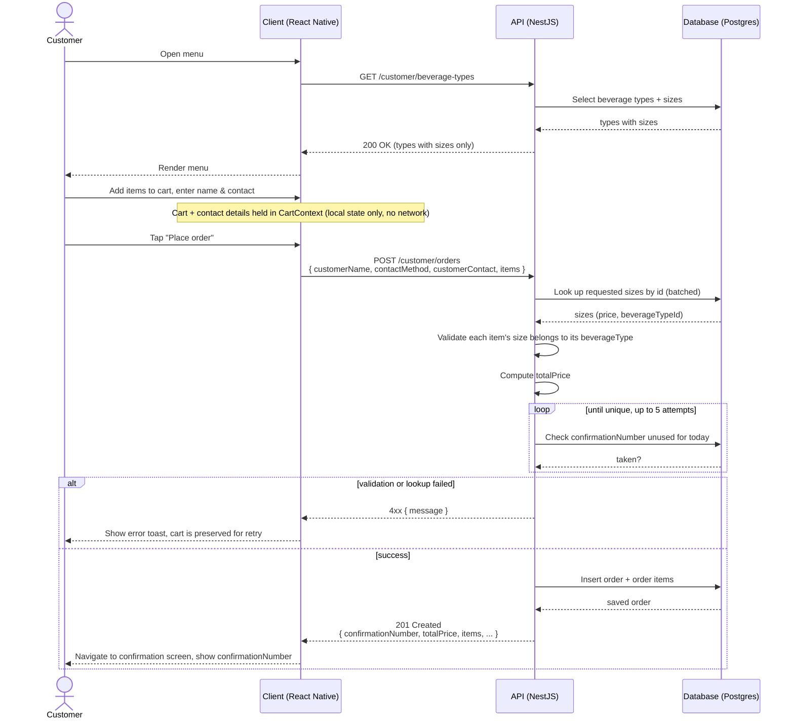

# Lemonade Stand

A mobile ordering app for a lemonade stand: customers browse beverages, build an order, and get a confirmation number; admins manage the beverage catalog through a separate set of API endpoints. The project has two parts: `server/`, a NestJS, TypeORM, and PostgreSQL API, and `client/`, a React Native (Expo) app.

## Prerequisites

Running this project requires Node.js 22 or later and npm. [Docker Desktop](https://www.docker.com/products/docker-desktop/) is recommended for running the backend and database. Xcode is required on a Mac for the iOS Simulator; see the note below on why this is the tested path. The client also depends on `expo-dev-client`, so it needs a custom development build and will **not** run inside the plain [Expo Go](https://expo.dev/go) app.

## Backend (`server/`)

### Run with Docker (recommended)

```bash
cd server
docker compose up -d --build
```

This starts two containers: `postgres`, running Postgres 16 with a named volume so data survives restarts, and `app`, the NestJS API built from `server/Dockerfile`.

The API is available at `http://localhost:3000`, health check at `http://localhost:3000/api/health`, and interactive Swagger docs at `http://localhost:3000/docs`.

The `admin/*` routes are unauthenticated (see [Assumptions & Design Choices](#assumptions--design-choices)); no key or header is needed to call them.

To stop: `docker compose down` (add `-v` to also delete the Postgres volume and its data).

### Run locally (without Docker)

You'll need a Postgres instance (14+) of your own. `.env.example` expects a database called `lemonade`, owned by a user called `lemonade` with password `lemonade`, running on `localhost:5432`. None of that exists on a fresh Postgres install, so create it first with one command:

```bash
psql postgres -c "CREATE ROLE lemonade WITH LOGIN PASSWORD 'lemonade'; CREATE DATABASE lemonade OWNER lemonade;"
```

Then:

```bash
cd server
cp .env.example .env   # works unedited against the database created above
npm install
npm run start:dev
```

The app creates its own schema on boot (`synchronize: true`; see [Assumptions](#assumptions--design-choices)), so no manual migration step is required.

### Seeding beverage data

A fresh database starts with zero beverage types, so the client's menu will be empty until you create some. Run:

```bash
cd server
npm run seed
```

This creates a few sample beverage types with sizes and prices (through the same `BeverageTypesService`/`BeverageSizesService` the admin API uses), plus one type with no sizes yet ("Seasonal Special") to demonstrate that types without a price are excluded from the customer-facing `GET /customer/beverage-types` list. See `server/src/seed.ts`.

Alternatively, create data by hand through the admin endpoints, either through the Swagger UI at `/docs` or with curl. For example:

```bash
curl -X POST http://localhost:3000/api/v1/admin/beverage-types \
  -H "Content-Type: application/json" \
  -d '{"name":"Classic Lemonade","description":"Fresh-squeezed lemons, cane sugar, ice-cold."}'

curl -X POST http://localhost:3000/api/v1/admin/beverage-sizes \
  -H "Content-Type: application/json" \
  -d '{"label":"Small","price":2.50,"beverageTypeId":"<id from the response above>"}'
```

### API Reference

Full interactive documentation, including a try-it-out console, is at **`http://localhost:3000/docs`** (Swagger UI) once the server is running. The reference below covers the same endpoints for quick copy-paste.

All paths are relative to the base URL `http://localhost:3000/api/v1`. `customer/*` endpoints are what the app itself calls; `admin/*` endpoints manage the catalog and list orders, and are unauthenticated (see [Assumptions & Design Choices](#assumptions--design-choices)).

#### Beverage types

| Method | Path | Description |
| --- | --- | --- |
| GET | `/customer/beverage-types` | List beverage types that have at least one size (i.e. orderable) |
| GET | `/customer/beverage-types/:id` | Get one beverage type |
| GET | `/admin/beverage-types` | List **all** beverage types, including ones with no sizes yet |
| GET | `/admin/beverage-types/:id` | Get one beverage type |
| POST | `/admin/beverage-types` | Create a beverage type |
| PATCH | `/admin/beverage-types/:id` | Update a beverage type (any subset of the create fields) |
| DELETE | `/admin/beverage-types/:id` | Delete a beverage type and its sizes (returns `204 No Content`) |

`POST`/`PATCH` request body:

```jsonc
{
  "name": "Classic Lemonade",
  "description": "Fresh-squeezed lemons, cane sugar, ice-cold." // optional
}
```

Response (`GET`/`POST`):

```jsonc
{
  "id": "b1f2c3d4-5678-90ab-cdef-1234567890ab",
  "name": "Classic Lemonade",
  "description": "Fresh-squeezed lemons, cane sugar, ice-cold.",
  "sizes": [
    { "id": "8a9b0c1d-...", "label": "Small", "price": "2.50", "beverageTypeId": "b1f2c3d4-..." }
  ]
}
```

#### Beverage sizes

| Method | Path | Description |
| --- | --- | --- |
| GET | `/customer/beverage-sizes` | List all beverage sizes |
| GET | `/customer/beverage-sizes/:id` | Get one beverage size |
| GET | `/admin/beverage-sizes` | List all beverage sizes |
| GET | `/admin/beverage-sizes/:id` | Get one beverage size |
| POST | `/admin/beverage-sizes` | Create a size (and price) for a beverage type |
| PATCH | `/admin/beverage-sizes/:id` | Update a size (any subset of the create fields) |
| DELETE | `/admin/beverage-sizes/:id` | Delete a size (returns `204 No Content`) |

`POST`/`PATCH` request body:

```jsonc
{
  "label": "Small",
  "price": 2.50,
  "beverageTypeId": "b1f2c3d4-5678-90ab-cdef-1234567890ab" // id of an existing beverage type
}
```

#### Orders

| Method | Path | Description |
| --- | --- | --- |
| POST | `/customer/orders` | Submit an order; returns it with a confirmation number |
| GET | `/admin/orders` | List all submitted orders, newest first |

`POST /customer/orders` request body:

```jsonc
{
  "customerName": "Jane Doe",
  "contactMethod": "email", // "email" | "phone"
  "customerContact": "jane@example.com", // valid email, or ≥7 digits if contactMethod is "phone"
  "items": [
    { "beverageTypeId": "b1f2c3d4-...", "sizeId": "8a9b0c1d-...", "quantity": 2 }
  ]
}
```

Response:

```jsonc
{
  "id": "d4e5f6a7-...",
  "confirmationNumber": "LM-482913",
  "customerName": "Jane Doe",
  "contactMethod": "email",
  "customerContact": "jane@example.com",
  "totalPrice": "5.00",
  "orderDate": "2026-08-31",
  "createdAt": "2026-08-31T10:15:00.000Z",
  "items": [
    {
      "beverageTypeId": "b1f2c3d4-...",
      "beverageName": "Classic Lemonade",
      "sizeId": "8a9b0c1d-...",
      "sizeLabel": "Small",
      "unitPrice": "2.50",
      "quantity": 2
    }
  ]
}
```

### Backend tests

```bash
cd server
npm test          # unit tests
npm run test:cov  # unit tests with coverage
npm run test:e2e  # end-to-end tests
```

## Frontend (`client/`)

```bash
cd client
cp .env.example .env   # EXPO_PUBLIC_API_URL, defaults to http://localhost:3000/api/v1
npm install
npm run ios             # first run: builds a custom dev client and launches the iOS Simulator
```

**Development and testing focused on iOS, due to time constraints.** `npm run ios` (`expo run:ios`) is the tested, recommended path and is what the instructions below assume; `npm run android` should work the same way in principle, since nothing platform-specific was written, but it hasn't actually been run or verified.

The first `npm run ios` does a full native build (via Xcode/CocoaPods) and installs a custom dev client on the Simulator; this can take a few minutes the first time. After that, `npm start` and pressing `i` reloads the same build much faster. Because the client depends on `expo-dev-client`, the plain Expo Go app (App Store install, QR-code scanning) **cannot** run this project. Expo CLI detects `expo-dev-client` and always targets a custom development build instead, so there's no supported "just scan a QR code" path here.

**Note on `EXPO_PUBLIC_API_URL`:** `localhost` resolves to the device itself, not your development machine. On the iOS Simulator, the default `http://localhost:3000/api/v1` works as is. On a physical device, running through its own dev-client build, use your machine's LAN IP.

### Frontend tests

```bash
cd client
npm test
```

## Assumptions & Design Choices

1. **`synchronize: true` on the TypeORM connection.** The schema is created and updated automatically from the entities on boot. This is convenient for a take-home project but isn't safe for a production database with real data; a production setup would use TypeORM migrations instead.
2. **Admin routes (`/admin/*`) are intentionally left public**, with no login, API key, or role system in front of them, to keep catalog management easy to exercise while testing. A production setup would put real permission control in front of them.
3. **Seed script (`npm run seed` in `server/`).** It goes through the same admin services as the API, rather than inserting rows directly, so seeded data exercises the same validation. Beverage types and sizes can also be created by hand through the admin API (see above).
4. **Prices are stored as `decimal` columns (as strings) in Postgres.** This avoids floating-point rounding issues with money; the client converts them to `number` at the API boundary for display and arithmetic.
5. **`totalPrice` is never accepted as client input.** `POST /customer/orders` only takes `beverageTypeId`, `sizeId`, and `quantity` per line item; the server looks up each size's current price from the database and computes the total itself. The order record (and the API response) does include a `totalPrice`, satisfying "an order should include... total order price" from the requirements. It's just computed server-side rather than trusted from the client, since accepting a client-supplied total would let anyone submit an arbitrary price for their order. The client still computes and displays a running total locally as the cart is built, purely for UX; the server ignores it and computes its own authoritative figure at submission time.
6. **Confirmation numbers** are generated as `LM-` followed by a random 6-digit number, checked for uniqueness against existing orders with a few retries before giving up.
7. **Cart state lives only in memory** (React Context) and isn't persisted to device storage, so a reload or app restart clears the in-progress order. Submitted orders are, of course, persisted server-side.
8. **Contact method is phone or email**, chosen with a toggle; validation on both the client and server adapts to whichever is selected.

## Bonus Features Implemented

1. **Unit tests.** Both apps have unit test coverage. On the backend, this covers services, controllers, the global exception filter, and DTO input-validation tests (using `class-validator`'s `validate()` directly against each DTO) for every module. On the frontend, it covers the cart context and state management, the `useBeverages` data-fetching hook, the `lib/` API layer (request handling, error mapping, response shaping), and a shared component.
2. **Input validation on both sides.** The backend uses a global `ValidationPipe` (`whitelist`, `forbidNonWhitelisted`, `transform`) plus `class-validator` decorators on every DTO (UUIDs, enums, positive numbers, required strings, nested array validation for order line items), including a custom validator that checks `customerContact` is a well-formed email or phone number depending on the selected `contactMethod`. The frontend's customer-details form uses `react-hook-form` with `zod` for validation (name length, and phone or email format depending on the selected contact method).
3. **State management.** `@tanstack/react-query` handles all server data (beverages, order submission) with proper loading, error, and refetch states, and React Context (`CartProvider`) handles local cart state shared across the ordering flow.
4. **Containerization.** `server/Dockerfile` (a multi-stage build) and `server/docker-compose.yml` run the API and Postgres together, each with health checks.
5. **Sequence diagram.** See [Order Placement Flow](#order-placement-flow) below.

## Order Placement Flow


